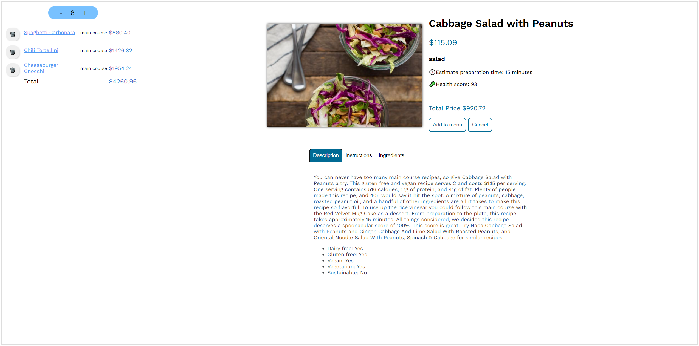

<<<<<<< HEAD
# Search Menu

# Details View

# Summary View

=======
# DH2642 Interaction Programming and the Dynamic Web

Interaction programming gives the basic Model-View-Controller principles for developing interactive applications. These principles can be applied to many desktop, mobile or web apps frameworks. The course currently applies these principles to web applications, using JavaScript, DOM APIs, HTML, CSS etc. These front-end applications use data from remote back-ends using web APIs.

### Course contents

- JavaScript for interaction programming, callbacks, synchronous and asynchronous code, functional programming.
- Web development interfaces (API): REST, JSON, AJAX, Fetch, Promises.
- Local data: cookies, local storage.
- User interfaces, appearance: HTML, CSS, DOM API, other tree based frameworks for user interfaces (e g Android).
- User interfaces, interaction: events, event levels, event propagation, event management.
- User interfaces, architectures: Model-View-Controller.
- User interfaces, frameworks: React, Angular, Vue.

https://www.kth.se/student/kurser/kurs/DH2642?l=en

## Lab Tasks
### Tutorial Week 1
Intro to JavaScript, HTML, JSX, Rendering, Events, State

### Turoriak Week 2
Promises, CSS and finish Rendering

### Tutorial Week 3
Observer, subscriptions, navigation, persistence (Firebase)

## Search Menu

## Details View

## Summary View

### Bonus Points
- TW1 on time
- TW2 on time
- TW3 on time
- DinnerPlanner in The second framework
- DinnerPlanner Search-as-you-type with debouncing
>>>>>>> 874e9093f06e3d69c7fae1973bb97fb4aa62975a
